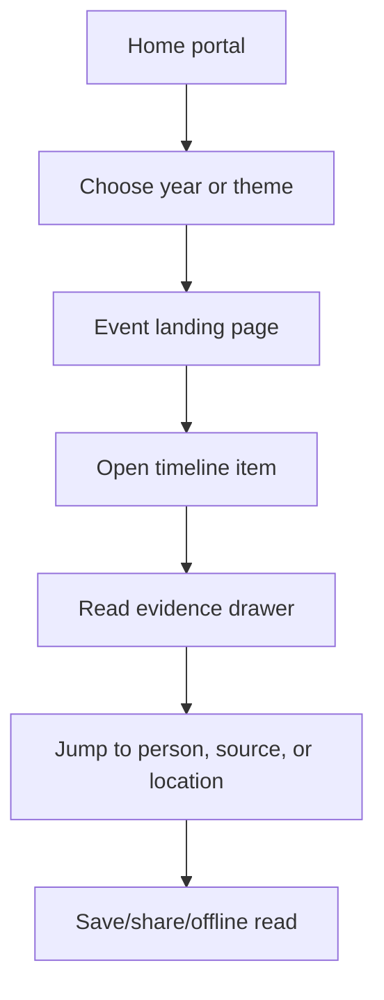
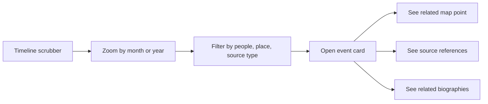

# Future Feature Extensions Roadmap for bengal-unfolded

## Executive summary

The strongest path for **bengal-unfolded** is a **static-first, provenance-first, bilingual knowledge product**: keep the public site lean with Next.js App Router, locale-based routing, static generation, and structured metadata; invest early in an editorial data model that treats every timeline entry, biography, map point, image, quote, and claim as a citable record with source links, rights metadata, and language variants; then introduce a CMS only when editorial workflow, preview, scheduling, and contributor moderation become real bottlenecks. That approach fits both the platform’s subject matter and the technical reality that Next.js supports internationalized routing and static export, while modern SEO guidance still requires explicit `hreflang`, proper metadata, and page-visible structured data. Accessibility should target WCAG 2.2 AA from day one, not as a late retrofit. citeturn21view2turn21view1turn14search0turn22view0turn22view1turn26view0turn26view1

For discovery, the best sequence is **Pagefind first, Meilisearch second, Elasticsearch only if justified by scope**. Pagefind is fully static, works with generated HTML, supports multilingual indexing automatically from the page `lang` attribute, and even supports Bengali UI translation, though Bengali stemming is not available. Meilisearch becomes attractive once the corpus grows into multi-collection search with filters, geo search, and admin-side indexing; its own guidance recommends separate indexes for multiple languages and explicit searchable/filterable attributes. Elasticsearch is the “heavy” option for hybrid retrieval, semantic search, advanced geospatial work, and ICU-based Unicode analysis, but it adds significant operational weight. citeturn22view3turn22view4turn23view1turn23view2turn23view0turn23view3turn23view4

The CMS migration point should be **after launch, not before**. Among current headless options, **entity["organization","Payload","headless cms"]** is the best fit if you want to stay in one Next.js codebase: field-level localization, drafts, preview, REST, GraphQL, and a Next.js-native admin surface all align with the bilingual archive/editorial workflow you described. **entity["organization","Strapi","headless cms"]** is the strongest alternative if you prefer a more clearly separated content service with mature locale-aware REST/GraphQL APIs and a more conventional headless-CMS operating model. citeturn33view0turn31view4turn33view1turn33view2turn32view0turn32view1turn32view2turn32view3turn32view4

The most important non-obvious recommendation is editorial governance. Because the subject area involves sensitive memory, contested narratives, and potentially traumatic images or testimony, the product should not treat “content” as loose Markdown blobs. It should treat the site as a **public-history archive with explicit evidence classes**: source-backed, editorially summarized, disputed, contextual, and community-submitted. This aligns better with documentary-heritage guidance from **entity["organization","UNESCO","un cultural agency"]**, preservation guidance from the **entity["organization","National Digital Stewardship Alliance","digital preservation coalition"]**, archival privacy principles from **entity["organization","IFLA","library federation"]**, and generative-AI governance guidance from **entity["organization","NIST","us standards institute"]**. citeturn28view0turn28view1turn29view0turn29view1turn29view2turn29view4

## Prioritized feature stack

The ranking below is based on four criteria: historical integrity, UX value, build complexity, and reversibility. Reversible, low-risk foundations come first; features that increase moderation burden, legal risk, or infrastructure complexity come later.

| Priority | Feature extension | Why it matters now | Effort | Impact | Recommended phase |
|---|---|---:|---:|---:|---:|
| Critical | Provenance-aware content model | Prevents “pretty website, weak archive” failure; enables citations, source drawers, evidence badges, future AI grounding | M | Very high | MVP |
| Critical | Bilingual routing, metadata, and SEO | `/en` and `/bn` must preserve language state, alternate-page mapping, canonical logic, and discoverability | M | Very high | MVP |
| Critical | Accessibility baseline | Historical/public-interest sites must work across keyboard, screen reader, reduced-motion, target-size, and mobile contexts | M | Very high | MVP |
| High | Interactive timeline engine | Makes the five-event structure legible and emotionally engaging without overwhelming users | M | High | MVP |
| High | Static full-text search | Immediate discoverability without backend ops | S | High | MVP / v1 |
| High | Multimedia pipeline | Audio, video, captions, transcripts, thumbnails, rights, and embeds are central to historical storytelling | M | High | v1 |
| High | Progressive web app reading mode | Helps low-bandwidth and mobile-first audiences; useful for classrooms and field use | M | Medium-high | v1 |
| High | Asset rights and preservation workflow | Required before archive scale-up; avoids broken provenance and rights ambiguity | M | High | v1 |
| Medium | CMS/editor workflow | Needed when multiple editors, draft review, and scheduled publishing appear | L | High | v2 |
| Medium | Faceted search engine | Needed when content grows beyond what static search handles elegantly | M/L | High | v2 |
| Medium | Maps/geospatial storytelling | Adds strong value for routes, sites, marches, killings, institutions, camps, memorials, and oral-history locations | M | Medium-high | v2 |
| Medium | Contributor submissions | Unlocks community growth, but only after moderation and source policy exist | L | High | v2 |
| Lower now | IIIF + METS interoperability | High-value archival standardization, but better after asset and metadata discipline exist | M/L | Medium-high | v3 |
| Lower now | RAG / AI Q&A | Valuable only after citations, source segmentation, and moderation guardrails are working | L | Medium-high | v3 |
| Lower now | Social/community layer | Powerful for engagement, but changes the moderation and legal profile of the project | L | Medium | v3 |

This ordering is supported by the shape of the official tooling ecosystem: Next.js explicitly supports static export, locale-aware routing, metadata, JSON-LD, PWA patterns, and progressive upgrades; Pagefind is optimized for static multilingual search; Meilisearch recommends language-separated indexes and explicit index configuration; WCAG 2.2 raises the bar on focus visibility, authentication, and target sizes; and documentary-heritage guidance consistently prioritizes preservation, access, and metadata quality before advanced presentation. citeturn21view1turn21view2turn14search0turn16search0turn15search0turn22view3turn22view4turn23view1turn26view0turn26view1turn28view0turn29view0

A concise search-stack decision rule is useful:

| Option | Use when | Strengths | Limits | Recommendation |
|---|---|---|---|---|
| Pagefind | Site remains static; corpus is mainly pages/MDX/doc pages | No infra, multilingual-by-HTML-language, facet/filter support, lightweight client bundle | Limited relevance tuning compared with dedicated engines; Bengali has no stemming | Best default for launch |
| Meilisearch | Need real API search, filters, geo, typo tolerance, richer indexing | Easier ops than Elasticsearch, strong developer ergonomics, language-aware tokenization, conversational-search path in managed offerings | Separate indexes per language are recommended; cloud-only advanced managed features change cost profile | Best mid-stage engine |
| Elasticsearch | Need hybrid search, larger corpus, advanced geo, ICU/transliteration, sophisticated relevance | Most powerful retrieval platform, semantic/hybrid retrieval, strong geo capabilities | Highest ops and cost burden | Only if scale or AI/search requirements demand it |

Pagefind’s Bengali support is especially relevant here: the UI supports `bn`, but root-word stemming is unavailable, which means exact forms and curated synonyms matter more than they do in English. Meilisearch supports datasets in any language, but its published dedicated tokenization table does not list Bengali specifically; Elasticsearch can add ICU-based normalization and transliteration through its ICU analysis plugin. citeturn22view4turn23view0turn23view3

## Phased roadmap

The roadmap below assumes one product team with strong frontend capability and moderate content-engineering capacity.

| Phase | Core milestone | Deliverables | Acceptance criteria |
|---|---|---|---|
| MVP | Public launch foundation | Static Next.js portal; `/en` and `/bn`; five event landing pages; shared content schema; timeline component; source drawer; figure/person/resource blocks; SEO metadata; JSON-LD; analytics; accessibility and performance QA | All core pages build statically; language switch preserves equivalent route; every narrative block can surface at least one source reference; Lighthouse performance and accessibility budgets are met on representative pages; no uncited “figure facts” in production |
| v1 | Discovery and media depth | Pagefind search; faceted browsing; transcripts/captions pipeline; audio/video pages; offline reading/PWA; rights model; downloadable reading lists; low-bandwidth mode; image zoom | Search works in both locales; captions or transcript fallbacks exist for all hosted media that the team publishes directly; app manifest and service worker pass install/offline smoke tests; media pages degrade gracefully on low bandwidth |
| v2 | Editorial scale and submissions | CMS migration; drafts/preview; role-based editorial workflow; contributor submission forms; moderation queue; static regeneration or selective dynamic routes; richer map layer; Meilisearch if corpus size justifies it | Editors can draft/review/publish without code changes; content IDs remain stable after migration; public pages remain fast; moderated submissions have status history; map and timeline items share a common evidence model |
| v3 | Archive-grade interoperability and intelligence | IIIF manifests for image/audio/video objects where relevant; METS export or package generation for archival batches; AI Q&A beta grounded only in approved sources; deeper geo storytelling; classroom packs and community programs | IIIF objects can be consumed by external viewers; AI responses always cite internal source records and show confidence/disclaimer states; preservation snapshots and fixity checks are automated; archive export is reproducible |

The phase boundaries match what the underlying platforms support well. Next.js supports static export today and progressive adoption of more server-like behavior later; its PWA and video guidance make v1 practical without a total architecture rewrite. Payload and Strapi both support localization and draft-oriented content operations when you reach v2. citeturn21view1turn15search0turn21view3turn33view0turn31view4turn32view0turn32view1turn32view2

A realistic milestone cadence for a focused team would look like this:

| Window | Most important outcome | Failure mode to avoid |
|---|---|---|
| First 6-8 weeks | Stable content schema, bilingual templates, event-page UX | Spending that time on CMS setup before proving page structure |
| Next 4-6 weeks | Search, timeline depth, media pages, QA | Shipping interactive pieces with weak accessibility or no citations |
| Next 8-12 weeks | CMS migration only if editorial pain is real | Premature backend complexity |
| After traction | Contributions, maps, AI, standards | Launching community/AI features before moderation and provenance exist |

## Data model and API evolution

The key schema decision is to stop thinking in “pages” and start thinking in **historical objects**. Each rendered page should be assembled from records that can be cited, translated, reused, reviewed, and exported. That is closer to archival and documentary-heritage practice and makes later features — search, maps, AI answers, contributor review, IIIF, classroom exports — much easier. citeturn28view0turn28view1turn29view0turn28view3

A pragmatic object model for your project:

| Collection / table | Purpose | Must-have fields | Future-facing fields |
|---|---|---|---|
| `events` | The five major historical entry points | `slug`, `year`, `title`, `summary`, `theme`, `heroAssetId` | `schemaType`, `mapBounds`, `featuredSourceIds` |
| `articles` | Long-form narrative pages, essays, explainers | `id`, `eventId`, `locale`, `title`, `deck`, `bodyMdx` | `claimIds`, `seo`, `readingTime`, `visibility` |
| `timeline_items` | Atomic chronological units | `id`, `eventId`, `dateStart`, `dateEnd`, `title`, `summary` | `locationId`, `sourceIds`, `personIds`, `importanceScore` |
| `people` | Heroes, leaders, organizers, writers, witnesses | `id`, `canonicalName`, `roleLabels`, `bios.{en,bn}` | `altNames`, `portraitAssetId`, `relatedEventIds`, `sourceIds` |
| `sources` | Books, documents, archives, oral history, newspapers | `id`, `type`, `title`, `citation`, `language`, `urlOrShelfmark` | `rights`, `archiveUrl`, `verificationStatus`, `iiifManifestUrl` |
| `assets` | Images, posters, scans, audio, video | `id`, `kind`, `storageKey`, `altText.{en,bn}`, `rightsStatus` | `checksumSha256`, `transcriptId`, `captionFile`, `blurSensitive` |
| `locations` | Mapable places | `id`, `name.{en,bn}`, `lat`, `lng`, `placeType` | `geojson`, `osmRef`, `regionTags` |
| `claims` | Editorially normalized statements | `id`, `statement`, `subjectType`, `subjectId`, `sourceIds` | `confidence`, `disputeStatus`, `editorialNote` |
| `contributions` | Community submissions | `id`, `submittedBy`, `status`, `payload`, `attachmentIds` | `moderationNotes`, `reviewerId`, `publishedObjectId` |

A representative JSON shape for the static phase:

```json
{
  "id": "timeline-1971-03-07-speech",
  "eventId": "1971",
  "locale": "en",
  "title": "Historic speech at the Racecourse",
  "dateStart": "1971-03-07",
  "summary": "A pivotal speech shaped the political moment before the war.",
  "people": ["person-bangabandhu"],
  "locations": ["loc-racecourse-maidan"],
  "sources": [
    {
      "sourceId": "src-unesco-7march",
      "role": "primary"
    },
    {
      "sourceId": "src-banglapedia-entry",
      "role": "secondary"
    }
  ],
  "claimIds": ["claim-7march-significance"],
  "tags": ["speech", "mobilization", "1971"],
  "ui": {
    "importance": 10,
    "accent": "amber"
  }
}
```

A future CMS-backed record should preserve the same logical contract even if storage changes. That is why the migration should introduce a **content adapter layer**, not a hard cutover. Public components should read from an interface such as `getEvent(slug, locale)`, `getTimeline(event, locale)`, and `getSource(id)` whether the backing store is filesystem JSON, MDX, Payload, or Strapi.

Recommended migration path:

```ts
// phase 1: filesystem adapter
export interface ContentRepository {
  getEvent(slug: string, locale: 'en' | 'bn'): Promise<EventRecord>
  getTimeline(eventSlug: string, locale: 'en' | 'bn'): Promise<TimelineItem[]>
  search(query: string, locale: 'en' | 'bn'): Promise<SearchResult[]>
}

// phase 2: plug in CMS adapter behind the same interface
export const repo: ContentRepository =
  process.env.CONTENT_BACKEND === 'cms'
    ? new CmsRepository()
    : new FileRepository()
```

Migration script outline:

```ts
// scripts/migrate-content.ts
// 1. Read MDX frontmatter + JSON blocks
// 2. Validate with Zod schemas
// 3. Normalize stable IDs and locale links
// 4. Extract referenced sources/assets into separate collections
// 5. Upload media manifests first
// 6. Create or upsert events, people, locations, articles, timeline items
// 7. Rebuild search index
// 8. Compare rendered snapshots before/after migration
```

For API design, keep the public surface boring and stable.

**REST example**

```http
GET /api/v1/events?locale=bn
GET /api/v1/events/1971?locale=en&include=timeline,people,resources
GET /api/v1/timeline?event=1971&locale=bn&from=1971-03-01&to=1971-12-31
GET /api/v1/search?q=ভাষা%20আন্দোলন&locale=bn&type=article,timeline_item,person
POST /api/v1/contributions
```

**GraphQL example**

```graphql
query EventPage($slug: String!, $locale: String!) {
  event(slug: $slug, locale: $locale) {
    slug
    year
    title
    summary
    timeline {
      id
      dateStart
      title
      summary
      sources { id title type }
    }
    featuredPeople {
      id
      canonicalName
      bio
    }
  }
}
```

If you choose Payload, you get localized fields, drafts, REST, GraphQL, and preview inside one Next.js-aligned stack. If you choose Strapi, you get locale-aware REST and GraphQL operations with explicit locale parameters and a cleaner front/back separation. citeturn33view0turn31view4turn33view1turn33view2turn32view1turn32view2turn32view3turn32view4

## Platform architecture and operations

The recommended architecture by phase is intentionally conservative.

| Phase | Frontend | Content source | Search | Media/storage | Analytics | Notes |
|---|---|---|---|---|---|---|
| MVP | Next.js App Router, static export | JSON + MDX in repo | Pagefind | Object storage for images; self-hosted video only if small | Privacy-friendly analytics | Lowest ops, strongest controllability |
| v1 | Next.js App Router + PWA | Same, with adapter layer | Pagefind | Object storage + transcript pipeline + optional streaming provider | Privacy-friendly analytics + event taxonomy | Still mostly static |
| v2 | Next.js + selective ISR/dynamic routes | Payload preferred, Strapi alternate | Pagefind or Meilisearch | R2-style object storage + signed upload path | Same | Introduce editor workflow |
| v3 | Next.js + archive services | CMS + preservation/export jobs | Meilisearch or Elasticsearch | IIIF-capable asset pipeline; archival packaging | Same + editorial metrics | Only when the corpus and team justify it |

For hosting, the easiest low-risk launch is a static frontend on **entity["company","Vercel","cloud deployment platform"]** or **entity["company","Cloudflare","edge cloud platform"]**, with large media in R2-like storage rather than in the frontend deployment itself. Vercel’s Hobby tier is free and Pro starts at $20/month plus usage; Cloudflare’s Workers/Pages stack starts free, its paid developer platform starts at $5/month, and R2 storage is priced at $0.015/GB-month with no egress fees and a free 10 GB-month tier. If you later add a database-backed CMS, **entity["company","Supabase","backend platform"]** offers a free tier with 500 MB database size and 50,000 monthly active users, which is enough for an early editorial backend. citeturn25view0turn31view0turn31view1turn24view3turn5search1

A practical hosting-cost view:

| Service | Best use here | Official entry point |
|---|---|---|
| Vercel | Fastest frontend setup for Next.js | Hobby free; Pro $20/month + usage citeturn25view0 |
| Cloudflare Pages / Workers | Cost-sensitive edge delivery and adjacent platform services | Free tier; paid developer plans start at $5/month citeturn5search8turn31view0 |
| Cloudflare R2 | Archive/media object storage | $0.015/GB-month standard, zero egress, 10 GB-month free tier citeturn24view3 |
| Cloudflare Stream | Managed video delivery | Starts at $5/month citeturn31view1 |
| Supabase | Editorial DB/auth/storage backend | Free tier includes 500 MB DB, 50k MAU citeturn5search1 |
| Meilisearch Cloud | Managed search when static search is insufficient | Usage-based plans start at $30/month; resource-based at $23/month citeturn24view2 |

For search and retrieval, my recommendation is:

- **Launch** with Pagefind.
- **Upgrade to Meilisearch** when you need cross-collection search, faceting, geo filtering, typo tolerance, or an internal API.
- **Use Elasticsearch** only if you concretely need hybrid retrieval, stronger geospatial analytics, semantic search control, or ICU-based normalization/transliteration across multilingual search. citeturn22view3turn22view4turn23view1turn23view2turn23view3turn23view4

For CI/CD, the pipeline should do more than lint and build. It should also validate historical content quality.

**Recommended pipeline stages**

| Stage | Purpose |
|---|---|
| Typecheck + lint | Keep component and content adapter contracts stable |
| Schema validation | Validate JSON/MDX frontmatter against Zod/JSON Schema |
| Link checking | Catch rot in source URLs and internal source drawers |
| Asset validation | Enforce alt text, captions/transcript presence, rights flags, file-size budgets |
| Search build | Generate Pagefind index or push Meilisearch documents |
| Snapshot rendering | Compare key routes before/after content migrations |
| Preview deploy | Editorial QA before publish |
| Release snapshot | Archive JSON export + manifest + checksums |

For security, public history sites often underestimate the risk surface once uploads, auth, or APIs appear. Use CSP early; require MFA for editors; keep admin and public auth separated; rate-limit contribution endpoints; never expose draft/unreviewed content through public search; and assume that broken object authorization, broken authentication, and unrestricted resource consumption will matter as soon as you expose any write API. Next.js documents CSP directly; OWASP’s API Security guidance highlights exactly those classes of failure; and NIST’s MFA guidance is unambiguous that passwords alone are not enough. citeturn25view1turn25view2turn25view4turn25view3

For analytics and privacy, two truths should guide implementation. First, if you store or access data on user devices with non-essential cookies, you generally need to tell users and get consent. Second, privacy-focused analytics can reduce consent complexity if they truly avoid cookies and personal data, but the exact legal posture still depends on jurisdiction and configuration. That makes self-hosted, minimized analytics much more appropriate than ad-tech-heavy tooling for this project. citeturn22view2turn31view2turn31view3

## UX and interaction patterns

The portal should feel less like a blog and more like a **living historical atlas plus evidence-backed memory archive**. The homepage should not immediately show five flat cards. It should stage three experiences in sequence: a “Bengal over time” motif, a five-event scrollytelling selector, and a “choose your way in” control by year, theme, people, and formats.

image_group{"layout":"carousel","aspect_ratio":"16:9","query":["digital archive iiif viewer interface", "interactive history timeline website design", "museum oral history archive map interface", "multilingual cultural archive website"],"num_per_query":1}

On each event landing page, the most compelling layout is a **three-band structure**:

1. **Narrative figure band** — cinematic opening, two-paragraph context, key dates, language toggle, “Start with timeline / people / sources”.
2. **Exploration band** — interactive timeline, thematic filters, featured biographies, key documents, map panel.
3. **Evidence band** — sources, books, image collections, oral histories, disputed-claim notes, downloadable resources.

This structure is consistent with both good historical UX and technical best practice: heavy components can be lazy-loaded, interactive media can be deferred, and core content remains understandable without JavaScript. Next.js recommends lazy loading to reduce initial JavaScript, and its video guidance explicitly supports self-hosted `<video>` elements with subtitles and `preload="none"` when you need tighter performance control. citeturn16search6turn21view3turn21view4

Maps should start simple. Use lightweight GeoJSON-driven maps with low visual noise, then move to vector-tile rendering only when you need richer layers or animated geospatial storytelling. Leaflet is intentionally lightweight and mobile-friendly, while MapLibre GL JS is better when vector-tile styling and more complex map interaction become necessary. If you use OpenStreetMap-derived data or tiles, attribution requirements must be built into the UI from the start. citeturn12search9turn12search5turn12search0turn12search3

For image, audio, and video collections, the long-term north star should be **entity["organization","International Image Interoperability Framework","digital image standard"]**. IIIF supports images and time-based media, lets viewers pan, zoom, compare, search associated text, and deep-link to specific regions and states, and provides a widely interoperable manifest model. For packaging and preservation interchange, **entity["organization","Library of Congress","washington dc, us"]** maintains METS as a standard for descriptive, administrative, and structural metadata in digital-library contexts. citeturn28view4turn28view2turn20search2turn20search9turn28view3

Two core user flows worth implementing early:





These interactions should be accompanied by explicit accessibility decisions tied to WCAG 2.2: keyboard-first timeline controls, visible focus, no drag-only interactions, adequate target size, reduced-motion support, and authentication that does not depend on memory-heavy or inaccessible patterns. citeturn26view0turn26view1

The design sprint should include at least five mockup images before engineering begins in full:

| Mockup | Why it matters |
|---|---|
| Portal homepage with five-event scrollytelling | Sets brand and navigation model |
| Event landing page with split timeline + map | Defines “signature” interaction |
| Biography page with evidence drawer | Tests depth without clutter |
| Oral-history player with transcript sync | Ensures media accessibility early |
| Search/results page in both English and Bengali | Forces bilingual IA decisions before implementation |

## Governance, sustainability, and external sources

For this subject matter, governance is a product feature. The public experience must distinguish among **archival fact, editorial summary, interpretation, unresolved dispute, and community submission**. That distinction matters for legal risk, public trust, classroom usability, and any future AI feature. **UNESCO**’s documentary-heritage framing emphasizes preservation and access; its genocide-education work emphasizes factual integrity and resilience against distortion; and archival privacy guidance warns against over-restrictive or over-exposed handling of sensitive records. citeturn28view0turn13search20turn29view2

A workable editorial policy model:

| Object type | Publication rule | Extra control |
|---|---|---|
| Timeline item | Must cite at least one source record | If disputed, show badge and editorial note |
| Biography | Must cite at least one secondary source and one archival/documentary source when possible | Track alternate spellings and transliterations |
| Image/audio/video | Must have rights state, alt text, and sensitivity flag | Blur/warning gate for traumatic content |
| Community submission | Never public by default | Human review, source review, abuse-rate limit |
| AI answer | Must only cite approved internal source records | Beta label, confidence band, no freeform unsourced claims |

If you later add AI Q&A, constrain it hard. Meilisearch’s own conversational-search docs explicitly note that responses should be grounded in indexed data, that source attribution should be surfaced, and that hallucinations remain possible even with source documents. NIST’s Generative AI profile emphasizes governance, content provenance, pre-deployment testing, and incident disclosure as primary considerations. For this project, that means AI should arrive only after the claim model, source records, and moderation rules are mature. citeturn24view0turn29view4

Preservation and backups need to be boring and reliable. Follow current **entity["organization","National Digital Stewardship Alliance","digital preservation coalition"]** thinking rather than improvised “copy the bucket sometimes” habits. At minimum: versioned object storage, database dumps, fixed release snapshots of public content, checksum records for critical assets, and an off-platform backup copy. The NDSA Levels explicitly frame preservation as staged, practical work, and the Library of Congress preservation resources highlight fixity and stewardship as core concerns. citeturn29view0turn29view1

For community and monetization, the highest-integrity options are the ones that reinforce the archive rather than distort it:

| Option | Fit | Risk |
|---|---|---|
| Donations / membership | Very strong | Low |
| Institutional sponsorship of digitization or translation work | Strong | Medium, if sponsors expect editorial influence |
| Grant-funded oral-history or scan projects | Strong | Medium, operational reporting burden |
| Classroom packs / educator subscriptions | Moderate | Must avoid paywalling core public-interest knowledge |
| Branded merchandise | Moderate | Can feel off-tone if overdone |
| Ads | Weak | Damages trust and performance profile |

A “community program” should focus first on **transcription, translation, metadata enrichment, and source-finding**, not freeform commenting. That gives people a meaningful role without turning the project into a moderation-heavy social platform.

Recommended external sources to consult as the project matures:

| Source | Why it matters |
|---|---|
| **entity["organization","Muktijuddho e-Archive","bangladesh war archive"]** | Existing digital-public-library model for liberation-war documents, multimedia, newspaper archive, and research resources citeturn26view4 |
| **entity["organization","Liberation War Museum","dhaka, dhaka, bangladesh"]** | Official museum archive with documents, oral history, photo archive, and audio-visual archive citeturn26view3turn10search5turn10search17 |
| **entity["book_series","Banglapedia","bangladesh encyclopedia"]** | Bilingual national encyclopedia and strong secondary-reference layer for contextual entries citeturn10search2turn10search14 |
| Department of Archives and Library of Bangladesh | Official archival authority and researcher-access path; consult for policy alignment and institutional partnerships citeturn10search0turn10search8turn10search12 |
| Bangladesh Government Press gazette archive | Official legal and administrative records archive, useful for primary-document linkage and timeline verification citeturn10search16 |
| **entity["organization","UNESCO","un cultural agency"]** Memory of the World and archives guidance | Preservation, access, digitization, and documentary-heritage framing citeturn28view0turn28view1 |
| **entity["organization","International Image Interoperability Framework","digital image standard"]** specifications | Interoperable manifests, viewers, search, deep linking, and time-based-media handling citeturn28view4turn28view2 |
| **entity["organization","Library of Congress","washington dc, us"]** METS resources | Archival metadata packaging and export discipline citeturn28view3 |
| **entity["organization","National Digital Stewardship Alliance","digital preservation coalition"]** | Practical preservation maturity model and assessment tools citeturn29view0turn29view1 |

Open questions remain. The biggest ones are not technical: the exact editorial position on disputed claims; the copyright/reuse status of scans, photos, oral histories, and newspaper pages; whether the project wants anonymous public submissions at all; and whether Bengali search should optimize for Bangla script only or also transliterated queries. Those decisions affect the schema, moderation model, and search stack materially. Where those policy choices are unresolved, the roadmap above deliberately favors reversible implementation patterns over permanent architecture bets.